# Arquitectura de la aplicacion

## Stack principal

- Next.js 16.2.3
- React 19.2.4
- Supabase:
  - Postgres
  - Auth
  - Realtime
- Tailwind CSS 4
- Leaflet + OpenStreetMap
- Twilio para notificaciones de prueba
- Vercel para despliegue web

## Vistas principales

### `/`

Landing del producto con explicacion comercial y acceso interno.

### `/login`

Entrada del personal interno.

### `/dashboard`

Panel de negocio/staff:

- crear pedidos
- ver pedidos activos
- abrir tracking publico
- abrir vista repartidor
- avanzar estados

### `/driver/[code]`

Vista operativa del repartidor:

- cambiar estados finales del pedido
- ver mapa
- copiar link publico
- mandar ubicacion una vez
- iniciar tracking cada 5 segundos
- simular avance

### `/track/[token]`

Vista del cliente:

- estado del pedido
- ETA
- eventos
- resumen
- mapa del pedido

## Capas internas del proyecto

### 1. Presentacion

Ubicada principalmente en:

- `app/`
- `app/_components/`

Responsabilidades:

- renderizar las vistas
- presentar formularios
- disparar server actions
- mostrar mapas, timeline y estados

### 2. Auth y autorizacion

Archivos clave:

- `lib/auth.ts`
- `app/auth/actions.ts`

Responsabilidades:

- validar sesion interna
- cargar perfil del usuario
- aplicar reglas por rol
- redirigir cuando no hay permisos

### 3. Capa de datos

Archivo central:

- `lib/tracking.ts`

Responsabilidades:

- leer dashboard
- leer pedido interno por tracking code
- leer pedido publico por token
- mapear filas de Supabase a objetos de UI
- formatear etiquetas y horarios

### 4. URLs publicas

Archivo:

- `lib/public-url.ts`

Responsabilidades:

- resolver la base del tracking
- construir links publicos por token
- distinguir entre entorno local, LAN o publico

### 5. Notificaciones

Archivo:

- `lib/notifications.ts`

Responsabilidades:

- decidir si un estado debe notificar
- construir mensaje de cliente
- enviar por Twilio
- adaptar telefono mexicano a formato esperado

### 6. Persistencia y acceso a Supabase

Archivos:

- `lib/supabase/server.ts`
- `lib/supabase/browser.ts`
- `lib/supabase/config.ts`

Responsabilidades:

- crear cliente de servidor
- crear cliente de navegador
- centralizar config de entorno

## Flujo principal del negocio

```mermaid
flowchart LR
  A["Staff crea pedido en dashboard"] --> B["Pedido se guarda en orders"]
  B --> C["Trigger crea evento en order_events"]
  C --> D["Pedido aparece en dashboard"]
  D --> E["Staff o driver cambia estado"]
  E --> F["Si llega a on_the_way se habilita tracking"]
  F --> G["Driver envia ubicacion a courier_locations"]
  G --> H["Cliente abre /track/[token]"]
  H --> I["La vista publica lee pedido, eventos y ultima ubicacion"]
```

## Flujo de acceso

### Interno

- Supabase Auth
- tabla `profiles`
- rol validado en `lib/auth.ts`

### Publico

- link privado por `public_tracking_token`
- lectura publica controlada por funciones RPC
- el cliente no lee tablas internas directamente

## Archivos clave para entender el sistema

- `app/dashboard/page.tsx`
- `app/dashboard/actions.ts`
- `app/driver/[code]/page.tsx`
- `app/driver/_components/driver-tracking-console.tsx`
- `app/track/[code]/page.tsx`
- `lib/tracking.ts`
- `lib/auth.ts`
- `lib/public-url.ts`
- `lib/notifications.ts`

## Decision de arquitectura mas importante

No se usa WhatsApp para el seguimiento continuo.

La estrategia correcta del producto es:

1. mandar un solo mensaje importante al cliente
2. abrir un link publico
3. vivir el tracking en la web

Eso reduce costo, volumen de mensajes y dependencia de mensajeria.
