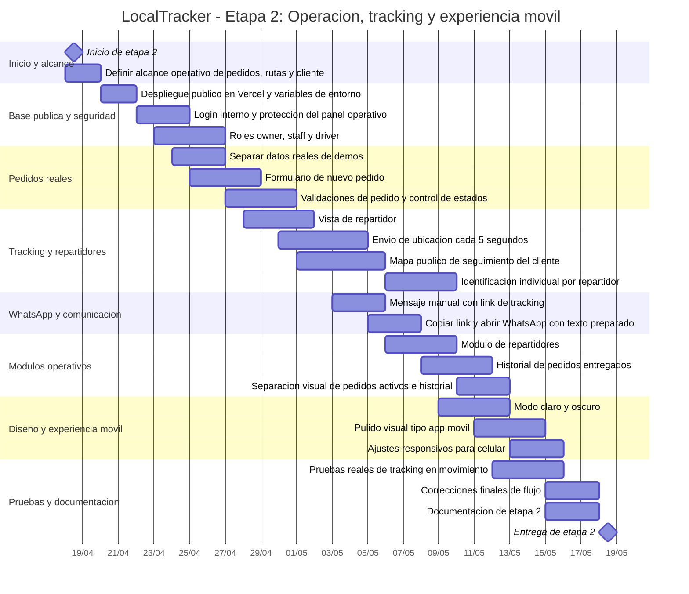

# LocalTracker - Diagrama de Gantt de la Etapa 2

Periodo general del proyecto: 18/04/2026 al 18/05/2026.

Alcance de esta etapa: cerrar el ciclo operativo del pedido, desde la creacion y asignacion interna hasta el seguimiento publico del cliente, el panel del repartidor, el historial y la preparacion visual de la app como producto usable.

## Diagrama de Gantt

## Tabla cronologica de procesos

| ID | Proceso | Fecha inicio | Fecha fin | Entregable esperado |
| --- | --- | --- | --- | --- |
| P2-01 | Definir alcance operativo de pedidos, rutas y cliente | 18/04/2026 | 19/04/2026 | Alcance claro de la etapa 2 |
| P2-02 | Despliegue publico en Vercel y variables de entorno | 20/04/2026 | 21/04/2026 | App accesible por URL publica |
| P2-03 | Login interno y proteccion del panel operativo | 22/04/2026 | 24/04/2026 | Panel protegido por autenticacion |
| P2-04 | Roles owner, staff y driver | 23/04/2026 | 26/04/2026 | Accesos separados por tipo de usuario |
| P2-05 | Separar datos reales de demos | 24/04/2026 | 26/04/2026 | Operacion basada en pedidos reales |
| P2-06 | Formulario de nuevo pedido | 25/04/2026 | 28/04/2026 | Captura interna de pedidos |
| P2-07 | Validaciones de pedido y control de estados | 27/04/2026 | 30/04/2026 | Flujo mas seguro: pendiente, confirmado, preparando, listo, en camino y entregado |
| P2-08 | Vista de repartidor | 28/04/2026 | 01/05/2026 | Pantalla dedicada para repartidores |
| P2-09 | Envio de ubicacion cada 5 segundos | 30/04/2026 | 04/05/2026 | Coordenadas actualizadas en tiempo real |
| P2-10 | Mapa publico de seguimiento del cliente | 01/05/2026 | 05/05/2026 | Link privado con mapa del pedido |
| P2-11 | Mensaje manual con link de tracking | 03/05/2026 | 05/05/2026 | Texto listo para enviar por WhatsApp |
| P2-12 | Copiar link y abrir WhatsApp con texto preparado | 05/05/2026 | 07/05/2026 | Flujo manual sin depender de Twilio Trial |
| P2-13 | Identificacion individual por repartidor | 06/05/2026 | 09/05/2026 | Acceso por ID de repartidor |
| P2-14 | Modulo de repartidores | 06/05/2026 | 09/05/2026 | Alta, edicion, descanso y disponibilidad |
| P2-15 | Historial de pedidos entregados | 08/05/2026 | 11/05/2026 | Vista separada para pedidos cerrados |
| P2-16 | Modo claro y oscuro | 09/05/2026 | 12/05/2026 | Interfaz con cambio visual por tema |
| P2-17 | Separacion visual de pedidos activos e historial | 10/05/2026 | 12/05/2026 | Dashboard menos saturado |
| P2-18 | Pulido visual tipo app movil | 11/05/2026 | 14/05/2026 | UI mas parecida a aplicacion movil |
| P2-19 | Pruebas reales de tracking en movimiento | 12/05/2026 | 15/05/2026 | Validacion en celular y distintas redes |
| P2-20 | Ajustes responsivos para celular | 13/05/2026 | 15/05/2026 | Mejor lectura en pantallas pequenas |
| P2-21 | Correcciones finales de flujo | 15/05/2026 | 17/05/2026 | Version estable para entrega |
| P2-22 | Documentacion de etapa 2 | 15/05/2026 | 17/05/2026 | Evidencia tecnica y funcional |
| P2-23 | Entrega de etapa 2 | 18/05/2026 | 18/05/2026 | Cierre formal de la etapa |

## Resumen por bloques

| Bloque | Duracion aproximada | Resultado |
| --- | --- | --- |
| Seguridad y despliegue | 20/04/2026 - 26/04/2026 | App publica con panel protegido y roles |
| Pedidos reales | 24/04/2026 - 30/04/2026 | Captura, estados y validaciones del pedido |
| Tracking vivo | 28/04/2026 - 05/05/2026 | Repartidor emite ubicacion y cliente ve mapa |
| Comunicacion WhatsApp | 03/05/2026 - 07/05/2026 | Link manual listo para enviar al cliente |
| Modulos operativos | 06/05/2026 - 12/05/2026 | Repartidores, historial y orden visual del turno |
| Experiencia movil | 09/05/2026 - 15/05/2026 | Interfaz clara, oscura, responsiva y mas limpia |
| Cierre | 15/05/2026 - 18/05/2026 | Correcciones, documentacion y entrega |
